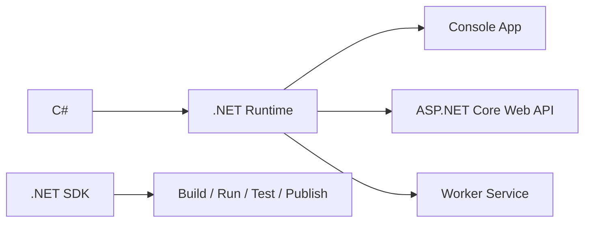
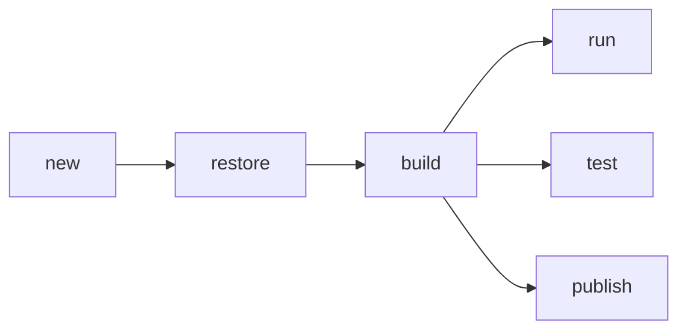
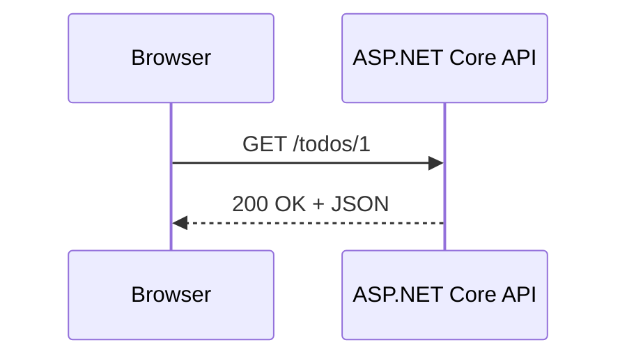
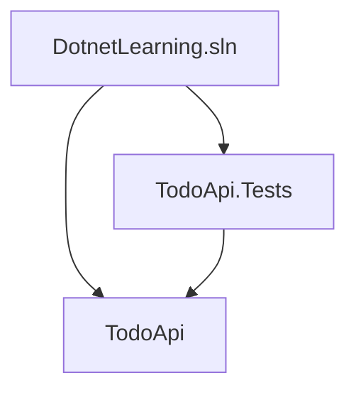
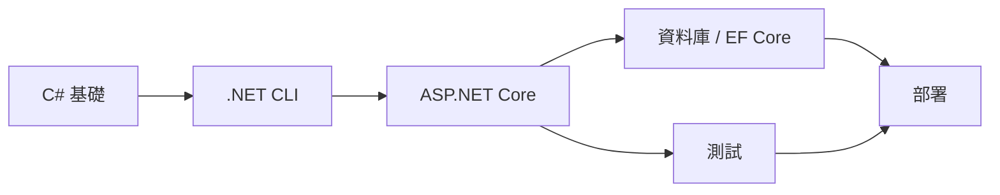

<div class="leading-snug text-black dark:text-white text-opacity-60 dark:text-opacity-60 mt-4 text-2xl">
  使用 VS Code Extension 學會 C#、專案、API、Debug、測試與發佈
</div>

<div class="mt-6 text-lg text-black dark:text-white text-opacity-50 dark:text-opacity-50">
  適合第一次接觸 .NET / C# 的後端入門課
</div>

<!--
開場：這堂課假設大家會基本電腦操作，但不假設會 C# 或 .NET。
目標是讓學生能自己在 VS Code 裡建立、執行、Debug 一個 API。
-->

---
layout: dynamic-image
left: false
---

# 今天會學到什麼

<v-clicks>

- .NET、C#、ASP.NET Core 之間的關係
- 用 VS Code 安裝 C# Dev Kit 與 .NET SDK
- 建立第一個 Console App
- 看懂專案檔、Program.cs 與 dotnet CLI
- 建立 Minimal API，使用 Swagger / OpenAPI 測試
- 用 VS Code 下中斷點 Debug
- 加入 NuGet 套件、設定檔、相依性注入
- 寫第一個測試，最後發佈成可部署檔案

</v-clicks>

---
layout: dynamic-image
left: false
---

# 先釐清名字



<div class="mt-8 grid grid-cols-3 gap-4 text-left text-sm">
  <div class="rounded border border-gray-300/30 p-4">
    <div class="font-bold">C#</div>
    <div class="opacity-75">程式語言</div>
  </div>
  <div class="rounded border border-gray-300/30 p-4">
    <div class="font-bold">.NET 9</div>
    <div class="opacity-75">執行平台與標準函式庫</div>
  </div>
  <div class="rounded border border-gray-300/30 p-4">
    <div class="font-bold">ASP.NET Core</div>
    <div class="opacity-75">建立 Web / API 的框架</div>
  </div>
</div>

<!--
.NET Core 是舊稱脈絡，現在官方主要稱 .NET。很多人仍會說 dotnet core，所以這堂課用 .NET 9 / .NET Core 9 對齊常見說法。
-->

---
layout: dynamic-image
left: false
---

# 開發環境

<div class="grid grid-cols-2 gap-10">
<div>

### 必裝

- Visual Studio Code
- .NET 9 SDK
- VS Code Extension: C# Dev Kit

### 建議安裝

- .NET Install Tool
- NuGet Package Manager
- REST Client 或 Thunder Client

</div>
<div>

### 檢查指令

```bash
dotnet --version
dotnet --info
code --version
```

### 版本概念

- SDK: 建立與編譯專案
- Runtime: 執行已編譯的 App
- Target Framework: 專案目標，例如 `net9.0`

</div>
</div>

---
layout: dynamic-image
left: false
---

# VS Code 裝 Extension

1. 開啟 VS Code
2. 左側 Extensions
3. 搜尋 `C# Dev Kit`
4. 安裝 Microsoft 發行的套件
5. 重新載入 VS Code

<div class="mt-8">

```txt
C# Dev Kit 會搭配 C# extension，
提供 Solution Explorer、Project Templates、測試探索、Debug 等功能。
```

</div>

<div class="mt-6 text-sm opacity-70">
課堂中會用 Extension 操作，也會保留 CLI 指令，方便你理解背後發生什麼事。
</div>

---
layout: dynamic-image
left: false
---

# 建立第一個專案

## VS Code 操作

<v-clicks>

- Command Palette: `Ctrl/Cmd + Shift + P`
- 執行 `.NET: New Project`
- 選 `Console App`
- 選資料夾並命名 `HelloDotnet`
- 按 VS Code 的 Run / Debug 執行

</v-clicks>

## 對應 CLI

```bash
dotnet new console -n HelloDotnet
cd HelloDotnet
dotnet run
```

---
layout: dynamic-image
left: false
---

# Console App 長什麼樣

```csharp [Program.cs]
Console.WriteLine("Hello, .NET 9!");
```

<div class="mt-8 grid grid-cols-2 gap-6 text-left">
  <div>
    <h3>Top-level statements</h3>
    <p class="text-sm opacity-75">C# 可以省略傳統 Main 方法，讓入門程式更短。</p>
  </div>
  <div>
    <h3>執行流程</h3>
    <p class="text-sm opacity-75">編譯後由 .NET Runtime 執行，輸出到終端機。</p>
  </div>
</div>

---
layout: dynamic-image
left: false
---

# 專案檔 csproj

```xml [HelloDotnet.csproj]
<Project Sdk="Microsoft.NET.Sdk">
  <PropertyGroup>
    <OutputType>Exe</OutputType>
    <TargetFramework>net9.0</TargetFramework>
    <ImplicitUsings>enable</ImplicitUsings>
    <Nullable>enable</Nullable>
  </PropertyGroup>
</Project>
```

<v-clicks>

- `Sdk` 決定專案類型與建置能力
- `TargetFramework` 指定目標版本
- `ImplicitUsings` 自動引用常用命名空間
- `Nullable` 幫你提早發現 null 風險

</v-clicks>

---
layout: dynamic-image
left: false
---

# C# 基礎語法

```csharp {all|1-3|5-8|10-14|all}
string name = "Ada";
int age = 28;
bool isDeveloper = true;

if (age >= 18)
{
    Console.WriteLine($"{name} 可以建立 .NET 專案");
}

for (int i = 1; i <= 3; i++)
{
    Console.WriteLine($"第 {i} 次練習");
}
```

<div class="mt-6 text-sm opacity-75">
先學會變數、條件、迴圈，再進到物件、API 與資料庫。
</div>

---
layout: dynamic-image
left: false
---

# 方法與型別

```csharp {all|1-5|7-12|all}
static decimal AddTax(decimal price, decimal taxRate)
{
    return price * (1 + taxRate);
}

var total = AddTax(100m, 0.05m);
Console.WriteLine(total);

public record Product(
    int Id,
    string Name,
    decimal Price);
```

<v-clicks>

- 方法負責封裝一段可重複使用的邏輯
- `record` 適合表示資料
- 型別讓 IDE 和編譯器提早抓錯

</v-clicks>

---
layout: dynamic-image
left: false
---

# dotnet CLI 心智模型

```bash
dotnet new console -n Demo
dotnet restore
dotnet build
dotnet run
dotnet test
dotnet publish
```



<div class="mt-4 text-sm opacity-75">
VS Code extension 很方便，但 CLI 是跨平台、自動化與 CI/CD 的共同語言。
</div>

---
layout: dynamic-image
left: false
---

# 建立 Web API

<div class="mt-6 text-3xl text-black dark:text-white text-opacity-55 dark:text-opacity-60">
  從會印字，到會回應 HTTP Request
  <light-icon icon="server" size="32px" />
</div>

---
layout: dynamic-image
left: false
---

# Web API 專案

## VS Code 操作

- Command Palette: `.NET: New Project`
- 選 `ASP.NET Core Web API`
- 命名 `TodoApi`
- 在 Solution Explorer 按 Run / Debug

## 對應 CLI

```bash
dotnet new webapi -n TodoApi
cd TodoApi
dotnet run
```

<div class="mt-6 text-sm opacity-75">
第一次執行 HTTPS 專案時，可能需要信任開發憑證。
</div>

---
layout: dynamic-image
left: false
---

# Minimal API

```csharp [Program.cs] {all|1-2|4-6|8-10|12|all}
var builder = WebApplication.CreateBuilder(args);
builder.Services.AddOpenApi();

var app = builder.Build();

app.MapOpenApi();

app.MapGet("/", () => "Hello API");
app.MapGet("/time", () => DateTimeOffset.Now);

app.Run();
```

<v-clicks>

- `builder` 設定服務與組態
- `app` 定義 middleware 與 endpoints
- `MapGet` 代表 HTTP GET 路由

</v-clicks>

---
layout: dynamic-image
left: false
---

# HTTP 與路由



| 動詞 | 常見用途 | 範例 |
| --- | --- | --- |
| GET | 讀取資料 | `/todos` |
| POST | 新增資料 | `/todos` |
| PUT | 整筆更新 | `/todos/1` |
| DELETE | 刪除資料 | `/todos/1` |

---
layout: dynamic-image
left: false
---

# 建立 Todo Endpoint

```csharp {all|1|3-8|10-11|13-15|all}
var todos = new List<TodoItem>();

app.MapGet("/todos", () => todos);

app.MapPost("/todos", (CreateTodoRequest request) =>
{
    var todo = new TodoItem(todos.Count + 1, request.Title, false);
    todos.Add(todo);
    return Results.Created($"/todos/{todo.Id}", todo);
});

public record TodoItem(int Id, string Title, bool IsDone);
public record CreateTodoRequest(string Title);
```

<div class="mt-6 text-sm opacity-75">
這是記憶體版本，重開程式資料會消失；之後再接資料庫。
</div>

---
layout: dynamic-image
left: false
---

# 用 OpenAPI 測試

`.NET 9` 的 ASP.NET Core 可內建產生 OpenAPI 文件。

```csharp
builder.Services.AddOpenApi();

if (app.Environment.IsDevelopment())
{
    app.MapOpenApi();
}
```

<v-clicks>

- 開啟 `http://localhost:{port}/openapi/v1.json`
- 可搭配 Swagger UI、Scalar 或 REST Client 測試
- API 文件讓前後端更容易對齊

</v-clicks>

---
layout: dynamic-image
left: false
---

# VS Code Debug

1. 在 `Program.cs` 左側點一下，加入 breakpoint
2. 開啟 Run and Debug
3. 選擇專案或 `.NET Core Launch`
4. 按 Start Debugging
5. 發送 request，觀察變數與呼叫堆疊

```csharp {2}
app.MapPost("/todos", (CreateTodoRequest request) =>
{
    var todo = new TodoItem(todos.Count + 1, request.Title, false);
    todos.Add(todo);
    return Results.Created($"/todos/{todo.Id}", todo);
});
```

---
layout: dynamic-image
left: false
---

# appsettings.json

```json [appsettings.Development.json]
{
  "AppOptions": {
    "DefaultPageSize": 20
  },
  "Logging": {
    "LogLevel": {
      "Default": "Information",
      "Microsoft.AspNetCore": "Warning"
    }
  }
}
```

<div class="mt-6 text-sm opacity-75">
設定檔放環境差異；程式碼放商業邏輯。密碼與 token 不要直接提交到 git。
</div>

---
layout: dynamic-image
left: false
---

# 相依性注入 DI

```csharp {all|1|3-11|13|all}
builder.Services.AddSingleton<TodoStore>();

public class TodoStore
{
    private readonly List<TodoItem> _todos = [];

    public IReadOnlyList<TodoItem> GetAll() => _todos;
    public void Add(TodoItem item) => _todos.Add(item);
}

app.MapGet("/todos", (TodoStore store) => store.GetAll());
```

<v-clicks>

- 服務在 `builder.Services` 註冊
- Endpoint 需要什麼，ASP.NET Core 會注入
- 這讓測試與替換實作更容易

</v-clicks>

---
layout: dynamic-image
left: false
---

# 加 NuGet 套件

## VS Code 操作

- 在 Solution Explorer 右鍵專案
- 選 Add NuGet Package
- 搜尋套件名稱
- 選版本並安裝

## 對應 CLI

```bash
dotnet add package Microsoft.EntityFrameworkCore.Sqlite
dotnet list package
```

<div class="mt-6 text-sm opacity-75">
NuGet 是 .NET 的套件生態系，類似 JavaScript 的 npm。
</div>

---
layout: dynamic-image
left: false
---

# 第一個測試

```bash
dotnet new xunit -n TodoApi.Tests
dotnet add TodoApi.Tests reference TodoApi
dotnet test
```

```csharp [TodoTests.cs]
public class TodoTests
{
    [Fact]
    public void NewTodo_IsNotDone_ByDefault()
    {
        var todo = new TodoItem(1, "Learn .NET", false);

        Assert.False(todo.IsDone);
    }
}
```

<div class="mt-6 text-sm opacity-75">
C# Dev Kit 會在 Testing 面板顯示測試，能單獨執行或 Debug。
</div>

---
layout: dynamic-image
left: false
---

# Solution 管理多專案

```bash
dotnet new sln -n DotnetLearning
dotnet sln add TodoApi/TodoApi.csproj
dotnet sln add TodoApi.Tests/TodoApi.Tests.csproj
```



<div class="mt-6 text-sm opacity-75">
Solution 是工作區清單；大型專案通常會拆成 API、Domain、Infrastructure、Tests。
</div>

---
layout: dynamic-image
left: false
---

# 發佈 Publish

```bash
dotnet publish -c Release -o ./publish
```

產出會包含：

<v-clicks>

- 編譯後的 DLL / executable
- 設定檔
- 相依套件
- 可部署到 VM、Container、PaaS 的檔案

</v-clicks>

<div class="mt-8 text-sm opacity-75">
學會本機 publish 後，再進一步學 Docker、CI/CD、雲端部署。
</div>

---
layout: dynamic-image
left: false
---

# 常見錯誤排查

| 狀況 | 檢查 |
| --- | --- |
| VS Code 沒有提示 | C# Dev Kit 是否啟用、SDK 是否安裝 |
| `dotnet` 找不到 | PATH 是否包含 .NET SDK |
| `net9.0` 不支援 | `dotnet --list-sdks` 是否有 9.x |
| HTTPS 失敗 | 開發憑證是否信任 |
| Port 被占用 | 換 port 或關掉舊 process |

---
layout: dynamic-image
left: false
---

# 練習路線

<v-clicks>

1. 建立 Console App，印出自己的名字
2. 建立 `Product` record 與計算稅金的方法
3. 建立 Todo Minimal API
4. 加入 GET / POST / DELETE
5. 用 VS Code Debug POST endpoint
6. 建立 xUnit 測試
7. `dotnet publish` 並檢查輸出

</v-clicks>

---
layout: dynamic-image
left: false
---

# 推薦學習順序



<div class="mt-8 text-left">

- 第 1 週：C#、Console、CLI、Debug
- 第 2 週：Minimal API、HTTP、OpenAPI
- 第 3 週：資料庫、EF Core、設定檔
- 第 4 週：測試、發佈、部署

</div>

---
layout: dynamic-image
left: false
---

# 參考資料

- Microsoft Learn: .NET 9 新功能
- Microsoft Learn: ASP.NET Core 9 新功能
- Microsoft Learn: C# Dev Kit for Visual Studio Code
- VS Code Marketplace: C# Dev Kit
- NuGet.org

<div class="mt-10 text-sm opacity-70">
真正的學習節奏：先讓專案跑起來，再逐步理解每一層。
</div>

---
layout: center-image
image: /static/light-icons-illustration.svg
---

# 下一步

打開 VS Code，建立你的第一個 `TodoApi`

<div class="mt-8 text-lg opacity-75">
從能跑開始，讓理解慢慢長出來。
</div>
